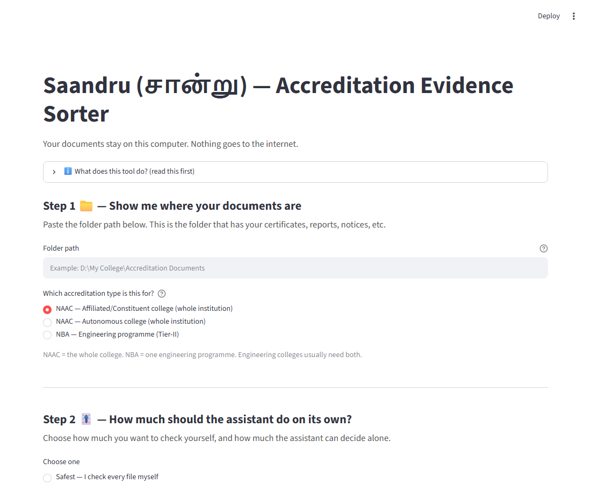
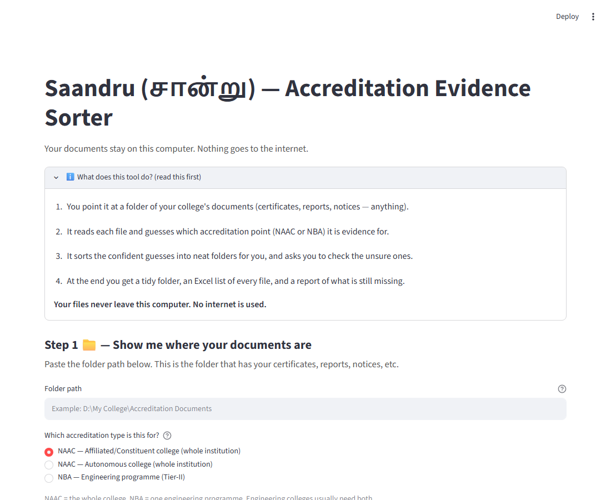
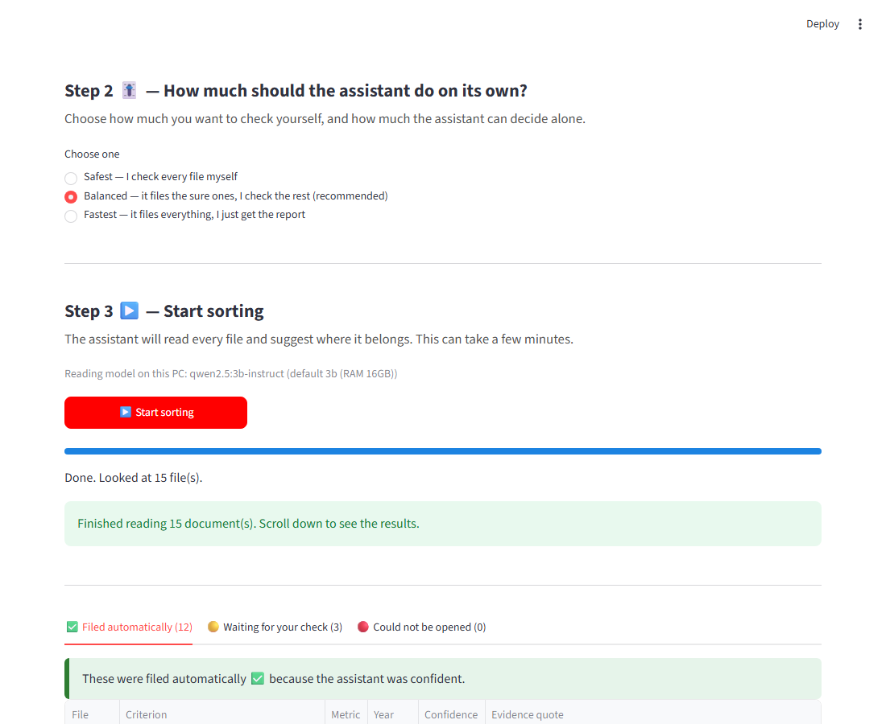
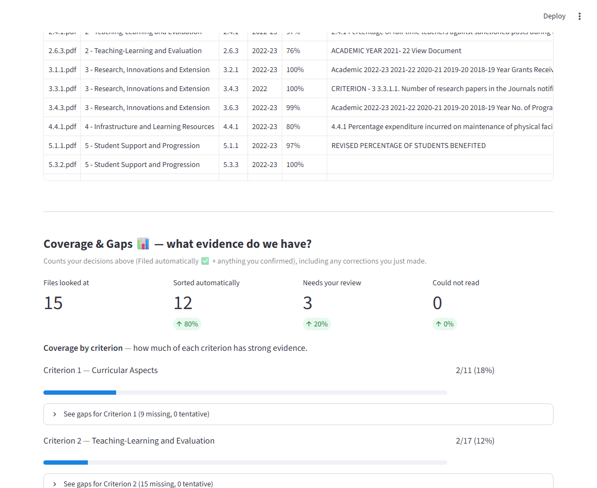

# Saandru — local, private accreditation evidence sorter

**Saandru** (சான்று, Tamil for "proof/evidence") is a free, open-source tool that helps small colleges
organise their accreditation evidence. Point it at a messy folder of documents; it reads each file,
matches it to the right accreditation criterion/metric, builds an evidence index (Excel) and a gap
report (PDF), and flags anything it is unsure about for a human to check.

*Built by **[Chitranjan Jegadeesan](https://chitranjanjegadeesan.in/)**.*

**Your documents never leave your computer. No cloud, no API keys, no internet connection needed once
the model is downloaded.**

## Screenshots

**Step 1 & 2 — point it at a folder, choose how much it should decide on its own**



**What the tool does, explained in one glance**



**After a run — files sorted, ready to review**



**Coverage & Gaps — what evidence exists, and what's still missing**



## Features

- **Automatic sorting** into accreditation criteria/metrics, using a small local language model.
- **Academic year detection** — pulls the AY (e.g. "2023-24") out of the document text where possible.
- **Suggested file naming** — proposes a clean, descriptive name for each document.
- **Gap report** — a plain-English report of what evidence is missing, available as `.txt`, a printable
  PDF, and a self-contained HTML file (works even on a PC without the PDF library installed).
- **Learns from your corrections** — when you accept or fix a suggestion, similar documents are
  recognised automatically next time (per accreditation pack).
- **Duplicate finder** — flags exact and near-identical files so you don't file the same evidence twice.
- **Tamper check** — after sorting, you can verify nothing in the sorted folder was changed, moved, or
  deleted by hand.
- **Works fully offline** — the language model runs locally via [Ollama](https://ollama.com); nothing is
  uploaded anywhere.
- **Calibrated oversight.** You choose how much the tool does alone:
  - **Safest — I check every file myself** (checks everything before it is filed).
  - **Balanced — it files the sure ones, I check the rest** (recommended).
  - **Fastest — it files everything, I just get the report** (files everything, gives a summary + audit log).

## How accurate is it?

Measured against three labeled test sets in `benchmarks/baseline.json` (run your own corpus for numbers
specific to your documents — accuracy depends heavily on document quality and how standardised your
naming/headings are):

| Test set | Docs | Criterion-level accuracy | Exact-metric accuracy | Committed & correct (on criterion) |
|---|---|---|---|---|
| Mock evidence set | 15 | 100% | 71.4% | 100% |
| Real SSR chunks (old narrative format) | 13 | 61.5% | n/a (different pack format) | 66.7% |
| Real DVV evidence set (autonomous pack) | 15 | 86.7% | 33.3% | 100% |

**Honest read of these numbers:** criterion-level accuracy (did it find the right general area, e.g.
"Criterion 3: Research") typically lands around **85–90%**, with high precision on whatever it actually
commits to automatically. Exact-metric accuracy (the precise sub-point, e.g. "3.4.2") is deliberately much
lower — around **33%** on real documents — **by design**: when the tool is only confident about the
general area, it marks that document "criterion-only / tentative" instead of guessing the exact metric,
and hands it to a human to confirm. This is why the oversight levels exist. Numbers vary run-to-run
(the model's self-consistency voting has some randomness) and will vary further on your own documents.

## Hardware needs

- **8 GB RAM minimum.** No GPU required — everything runs on CPU via Ollama.
- Saandru automatically picks a smaller/faster model on lower-RAM machines and a larger/more accurate
  model on machines with more RAM. The standard `qwen2.5:3b-instruct` model is used on any PC with
  **8 GB RAM or more** (its q4 build only needs about 2.3 GB of memory — slower on 8 GB, but usable);
  the smaller `qwen2.5:1.5b` is only used below 8 GB, as a last resort for genuinely weak machines
  (its accuracy is still being measured separately). See `src/ollama_client.py` for the exact logic.
  This happens automatically — you don't need to configure anything.

## Install

1. Install **Python 3.11** (or newer) if you don't have it: https://www.python.org/downloads/
2. Open a terminal in this folder and install the Python packages:
   ```
   pip install -r requirements.txt
   ```
3. Install **[Ollama](https://ollama.com)** (the local AI engine) and make sure it is running.
4. Pull the models Saandru uses:
   ```
   ollama pull nomic-embed-text
   ollama pull qwen2.5:3b-instruct
   ollama pull qwen2.5:1.5b
   ```
   (Saandru picks between the two `qwen2.5` models automatically based on your PC's RAM — pulling both is
   the safest option.)
5. *(Optional)* Install **Tesseract OCR** if you want to read scanned/photographed documents:
   https://github.com/UB-Mannheim/tesseract/wiki — everything else (text, Word, Excel, PowerPoint, PDF)
   works without it.
6. Run the setup doctor to confirm everything is ready:
   ```
   python setup_check.py
   ```
7. Start the app:
   ```
   streamlit run app.py
   ```
   Your browser opens automatically (usually at `http://localhost:8501`). Follow the on-screen steps:
   pick your documents folder, choose NAAC or NBA, choose how much the assistant should decide on its
   own, then press **Start sorting**.

## Criteria packs

Saandru ships with three accreditation checklists ("packs") in `criteria/`:

- `naac_affiliated_raf2021.yaml` — NAAC, Affiliated/Constituent UG & PG colleges (RAF).
- `naac_autonomous_raf.yaml` — NAAC, Autonomous colleges (RAF).
- `nba_ug_engg_tier2_gapc_v4.yaml` — NBA, UG Engineering programme (Tier-II).

New packs are auto-detected: drop a new `.yaml` file into `criteria/` following the same structure
(see `src/pack.py` for the exact fields it reads) and it appears in the app's dropdown automatically —
no code changes needed. `src/build_naac_pack.py` / `src/build_naac_autonomous_pack.py` /
`src/build_nba_pack.py` show how the existing packs were built from the official manuals (PDF → YAML).

Official accreditation manuals are © their issuing bodies (NAAC/NBA) and are **not** redistributed here
— see `reference/SOURCES.md` for where to download them.

## Limitations

- **English documents mainly.** The tool reads whatever text is in a document and matches it using an
  English-centric embedding model. Documents with an English heading or filename (even with a Tamil body)
  classify correctly; **pure Tamil documents with no English cue are sent to manual review on purpose**
  (a safety gate, not a bug) rather than risk a confidently-wrong auto-file. Full details and a live
  measurement: [`docs/tamil-experiment.md`](docs/tamil-experiment.md).
- **Pack completeness varies.** The NAAC Affiliated pack has metric types (`verify_type`) still being
  hand-verified; check each pack's own notes/comments in `criteria/` before relying on it for a real
  submission.
- **Not an official accreditation tool.** Saandru helps you *organise evidence for yourself* — it is not
  affiliated with, endorsed by, or a substitute for NAAC/NBA's own processes.
- **Scanned/photo documents** need Tesseract OCR installed (see Install, step 5); without it they are
  marked unreadable and sent to manual review rather than silently skipped.

## For researchers

The **oversight dial** (Safest / Balanced / Fastest, called L1/L2/L3 internally) is a deliberate design
feature: it lets you study how much a human should trust an AI assistant to act on its own in a real
office workflow, and how that trust should be calibrated by task confidence rather than fixed in advance.
The tool logs every decision (what was suggested, at what confidence, what a human did about it) so that
behaviour can be analysed afterward. No specific study, institution, or individual is referenced in this
codebase — build on it freely under the license below.

## License

[GNU AGPL-3.0](LICENSE), copyright 2026 Chitranjan Jegadeesan. In plain words: use Saandru freely —
including inside your college's daily work — but if you build software on top of it and give it to
others (including as a website or hosted service), your version's source code must be shared under
this same license. Colleges that simply USE the tool have nothing to do; this clause exists so the
tool and everything grown from it stays open.
